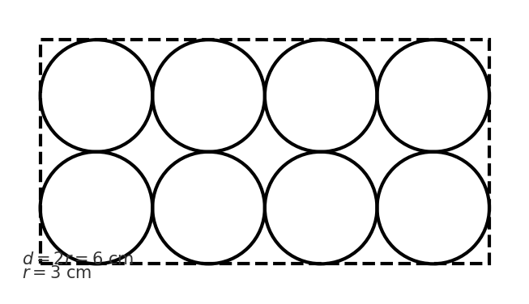

@title Combinatorics & Packing — Quantitative Assessment
@description This document contains two newly-generated multiple-choice math questions similar to the provided base questions. Each question preserves LaTeX formatting where applicable and includes subject/unit/topic tags from the curriculum.

@question Each athlete at Lakeview School wears a uniform consisting of 1 jersey and 1 pair of shoes. The table shows the colors available for each item. How many different uniforms are possible?

Shirt Colors: Blue, Green, White
Shoe Colors: Black, Brown, White, Gray

@instruction Select the number of distinct uniform combinations possible.
@difficulty easy
@Order 1

@option (A) Three
@option (B) Four
@option (C) Seven
@option (D) Ten
@@option (E) Twelve

@explanation There are 3 jersey choices and 4 shoe choices. Using the counting principle, number of combinations = 3 \times 4 = 12. Therefore the correct answer is 12.
@subject Quantitative
@unit Math Problem Solving
@topic Counting & Arrangement Problems
@plusmarks 1

@question The top view of a rectangular package of 8 tightly packed balls is shown. If each ball has a radius of 3 centimeters, which of the following are closest to the dimensions, in centimeters, of the rectangular package?

@instruction Choose the correct option that matches the package dimensions (height × width × length).
@difficulty moderate
@Order 2

@option (A) $3 \times 6 \times 12$
@option (B) $6 \times 12 \times 18$
@option (C) $6 \times 8 \times 24$
@option (D) $6 \times 12 \times 24$
@@option (E) $9 \times 12 \times 24$

@explanation Each ball has diameter $d = 2r = 6\text{ cm}$. The balls are arranged in 2 rows and 4 columns, so width = $2d = 12\text{ cm}$, length = $4d = 24\text{ cm}$, and height = $d = 6\text{ cm}$. Dimensions (height × width × length) are $6 \times 12 \times 24$, so option (D) is correct.
@subject Quantitative
@unit Math Geometry and Measurement
@topic Circles (Area, circumference)
@plusmarks 1
